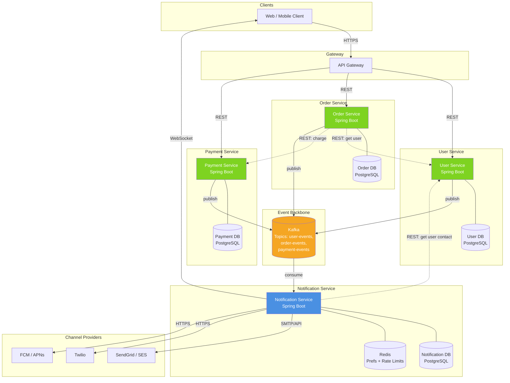

# Notification System — Microservices Architecture

Focused view of service boundaries, their own databases, and how they communicate (sync vs async).

---

## Service Responsibilities

**User Service** — owns user identity, contact info (email, phone, device tokens), and notification preferences. Source of truth for "who is this user and how do I reach them."

**Order Service** — owns order lifecycle (created, paid, shipped, delivered, cancelled). Publishes domain events when state changes.

**Payment Service** — owns payment transactions and refunds. Publishes events for succeeded, failed, refunded.

**Notification Service** — consumes events from all three services, renders templates, applies user preferences, and dispatches via channel providers. Owns its own notification history and delivery logs.

---

## Communication Patterns

**Synchronous (REST)** — solid arrows in the diagram:
- Client → Gateway → business services (user-initiated actions).
- Order Service → User Service (to fetch user during checkout).
- Order Service → Payment Service (to charge).
- Notification Service → User Service (to fetch contact details + preferences when processing an event).

**Asynchronous (Kafka)** — dashed/event arrows:
- User Service publishes `UserRegistered`, `PasswordReset`, `EmailVerified` to `user-events`.
- Order Service publishes `OrderPlaced`, `OrderShipped`, `OrderDelivered`, `OrderCancelled` to `order-events`.
- Payment Service publishes `PaymentSucceeded`, `PaymentFailed`, `RefundIssued` to `payment-events`.
- Notification Service consumes all three topics.

---

## Why This Shape

**Database per service.** Each service owns its schema. The Notification Service never reads the Order DB directly — it reconstructs what it needs from events plus a REST call to User Service for contact details. This keeps services independently deployable.

**Events for notification, REST for transactions.** Order and Payment still call each other synchronously because a checkout needs an immediate answer ("did the payment go through?"). Notifications don't need that — they're fire-and-forget downstream of the transaction, so Kafka is the right fit.

**Notification Service is a pure consumer.** It doesn't expose business APIs to the gateway. Its only inbound traffic is Kafka events (async) and an internal admin API for template management. This keeps the blast radius small — if it goes down, orders and payments keep working, notifications just queue up in Kafka.

**User Service is called by Notification Service, not the other way around.** When `OrderPlaced` arrives, Notification Service does a REST lookup to get `{email, phone, deviceTokens, preferences, locale}`. This avoids bloating every event with user PII (which would also create GDPR/retention headaches in Kafka).

**Redis cache on Notification Service.** User preferences and rate-limit counters live in Redis with a short TTL. A cache hit avoids a REST call to User Service on every event — important because notification volume is much higher than the services publishing the events.
