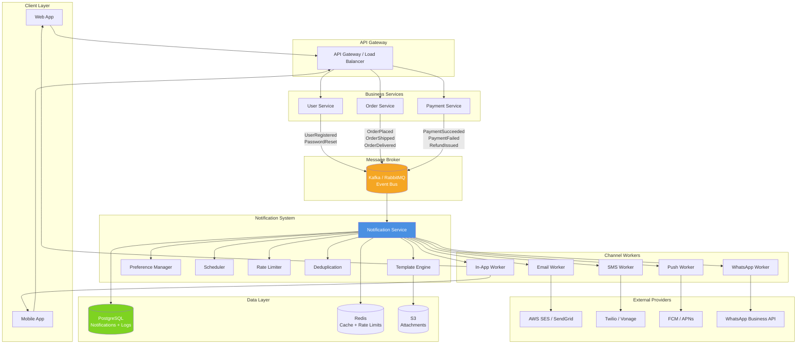
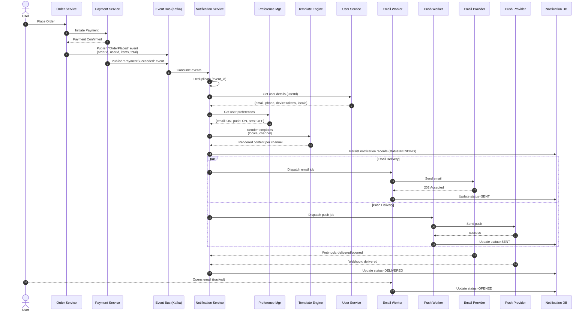
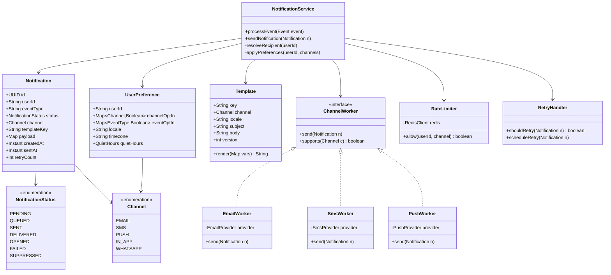
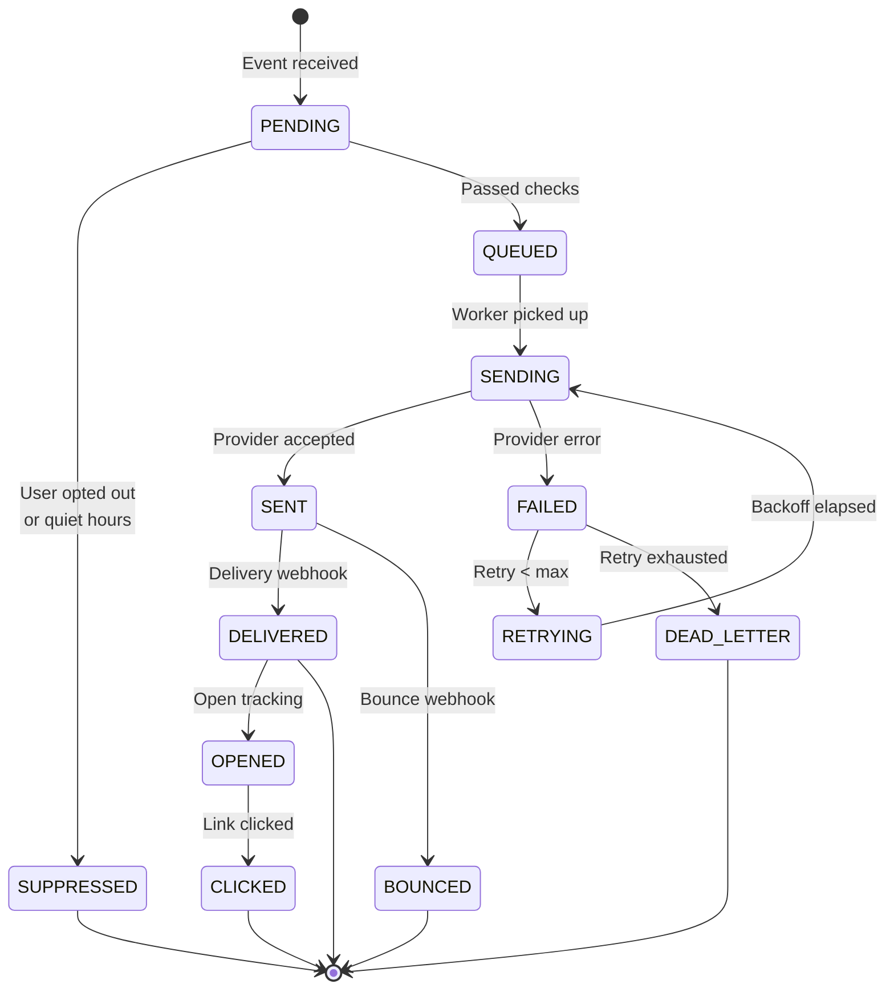
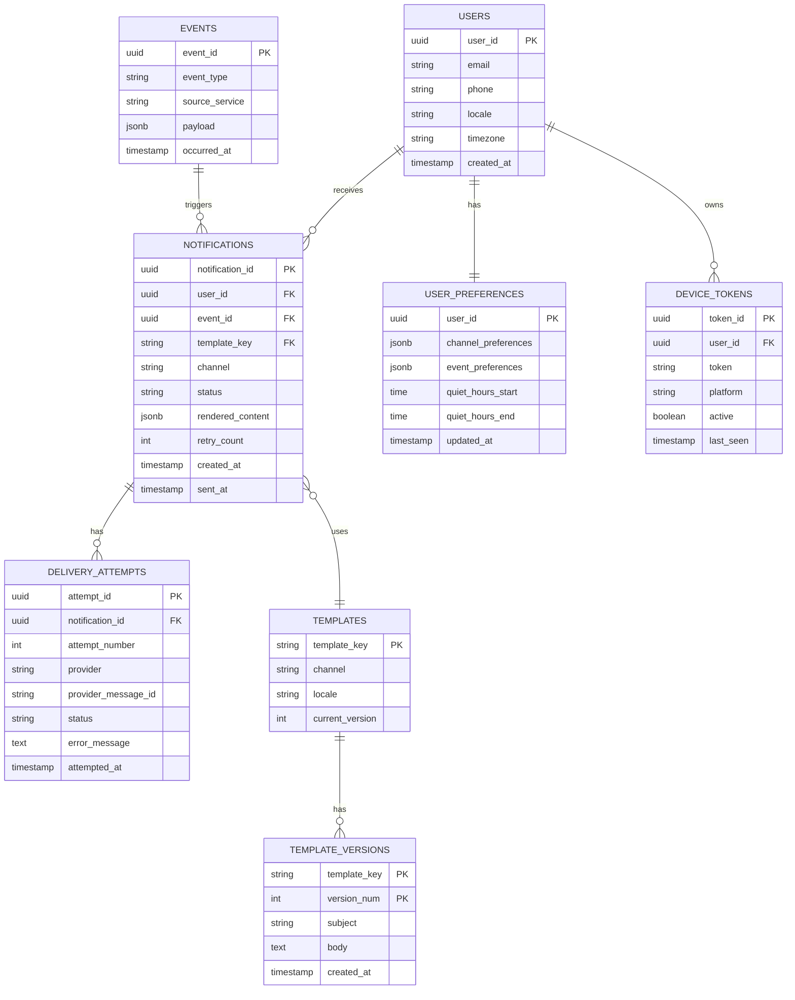
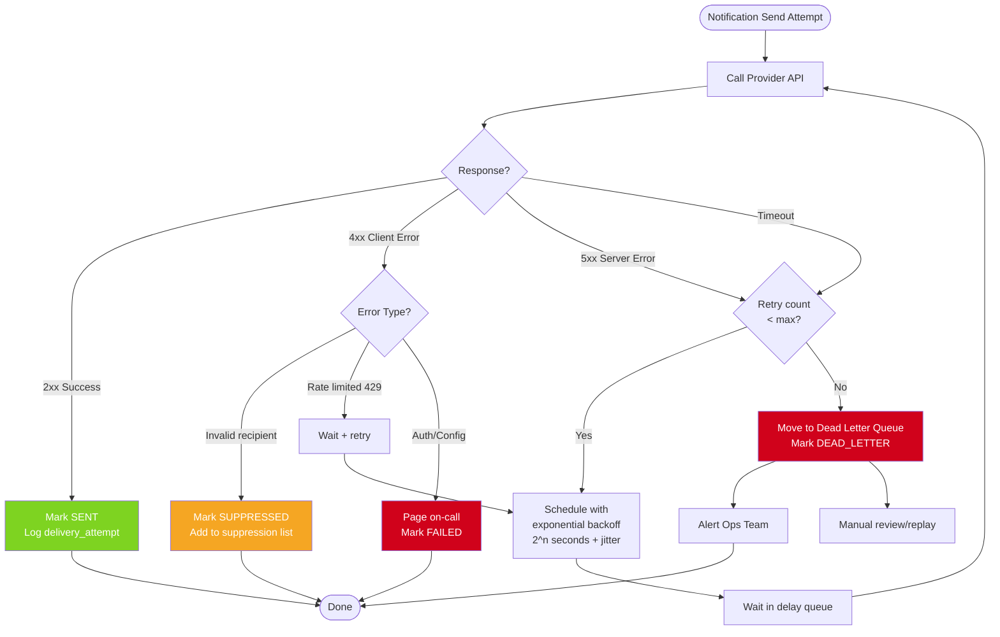

# Notification System Design

A comprehensive notification system design integrating with Payment, User, and Order services. This document covers architecture, data flow, components, and operational concerns.

---

## 1. High-Level Architecture

Shows how the notification service sits between business services (Payment, User, Order) and delivery channels.

---

## 2. Sequence Diagram — Order Placed Notification Flow

End-to-end flow when a user places an order, gets paid, and receives confirmation across multiple channels.

---

## 3. Component / Class Diagram

Internal structure of the Notification Service showing core domain entities.

---

## 4. State Diagram — Notification Lifecycle

The lifecycle a single notification goes through, including failure and retry paths.

---

## 5. ER Diagram — Data Model

Database schema for notifications, preferences, templates, and delivery logs.

---

## 6. Retry & Failure Handling Flow

How failed notifications are retried with exponential backoff and eventually moved to a dead letter queue.

---

## Key Design Decisions

**Event-driven via message broker.** Business services publish domain events to Kafka/RabbitMQ. The notification service consumes them, decoupling producers from notification logic. Adding a new notification type doesn't touch the Order or Payment service.

**Channel workers are pluggable.** Each channel (email, SMS, push) has its own worker pool. This isolates failures — if Twilio is down, email and push keep flowing. It also lets you scale workers independently based on volume.

**Idempotency via event_id.** Every event carries a unique ID. The notification service deduplicates on this before processing, so retries from the broker don't cause duplicate sends.

**User preferences as a first-class concern.** The Preference Manager checks opt-in status, quiet hours, and locale before any send. This keeps compliance (GDPR, CAN-SPAM) and UX concerns out of business services.

**Templates are versioned.** Marketing/product can update templates without code deploys. Versioning allows A/B testing and rollback.

**Retry with exponential backoff + jitter.** Transient failures retry with `2^n + random(0, 1000ms)` to avoid thundering herd. Permanent failures (invalid email) skip retry and go to a suppression list.

**Webhook ingestion for delivery status.** Providers like SES, Twilio, and FCM POST back delivery/bounce/open events. These update notification status for analytics and bounce handling.

**Rate limiting per user per channel.** Redis-backed token bucket prevents notification spam (e.g., max 10 push notifications per user per hour).
